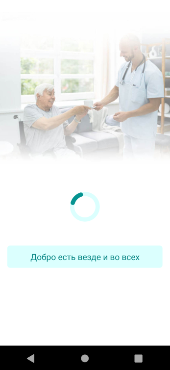

# Приложение «Мобильный хоспис»
## Задачи проекта:
- Планирование: определить "границы" приложения, реализованный функционал и заложить основу для тестов.
- Создание чек-листов и тест-кейсов;
- Создание и проведение автоматизированных тестов;
- Проведение ручного тестирования(в случае, если проведение автоматизированных тестов не будет возможным);
- Составление отчета по результатам тестирования.
## Описание проекта:
Приложение даёт функционал по работе с новостями хосписа и включает в себя:

- информацию о новостях и функционал для работы с ними;   
- тематические цитаты;  
- информацию о приложении.  

## [План проверок](doc/Plan.md)

## Процедура запуска тестов:
1. Склонировать проект командой git clone 
2. Открыть проект в Android Studio
3. Подождать, пока проект синхронизируется
4. Открыть папку fmh_android_15_03_24 (1)\app\src\androidTest\java\ru\iteco\fmhandroid\ui\tests
5. Правой кнопкой мыши кликнуть по папке tests и запустить тесты командой «Run 'Tests in iteco.fmhandroid.ui'»
6. Подождать прогона автотестов
7. Открыть Device Explorer: В Android Studio найдите и откройте окно “Device Explorer” (используем поиск, если необходимо)
8. Перейти в папку с результатами по пути /data/data/ru.iteco.fmhandroid.ui/files/allure-results
9. Кликнуть правой кнопкой мыши по папке files и выбрать Save As  - далее сохраняем папку в корневую директорию проекта
10. Перейти в терминал, перейти в корневую директорию проекта и выполнить команды:
    - allure serve - запускает временный веб сервер с результатами тестирования;
    - allure generate allure-results -o AllureResult - генерирует HTML отчет и сохраняет в папку;
    - allure open AllureResult - открывает сгенерированный отчет в браузере.

## [Отчет по проведенному тестированию](doc/Report.md)

