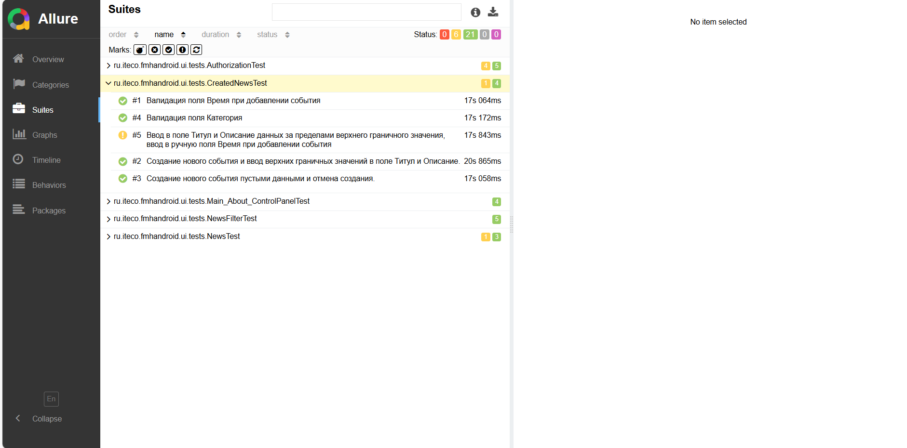

# Отчет по проведенному тестированию
## 1. Что было запланировано и что реализовано:
  
  

Были реализованы не все запланированные сценарии: 27 автоматизированных тестов и 4 ручных теста (Всего было запланировано 37 тестов - 27 автоматизированных и 10 ручных тестов)

Найдено 14 дефектов(6 дефектов при автомазириованном тестировании, 8 при ручном тестировании). Отчет о дефектах представлен ниже:  

## Allure отчет:
  
  
  
  
  

## Причины, по которым что-то не было реализовано:
Отсутствие телефона Android у тестировщика.

## Сработавшие риски:
- Трудности с поиском селекторов;
- Отсутствие телефона Android у тестировщика;
- Бытовые проблемы.

## Интервальная оценка с учётом рисков в часах:
1. Планирование тестирования - 6 часов;
2. Составление чек-листов и тест-кейсов - 5 часов;
3. Настройка тестовой среды - 30 часов;
4. Разработка автоматизированного тестирования - 40 часов;
5. Проведение автоматического тестирования - 1 час;
6. Проведение ручного тестирования - 1 час;
7. Составление отчета о проведенном тестировании - 2 часа;
_Итого:_ 83 часа.

